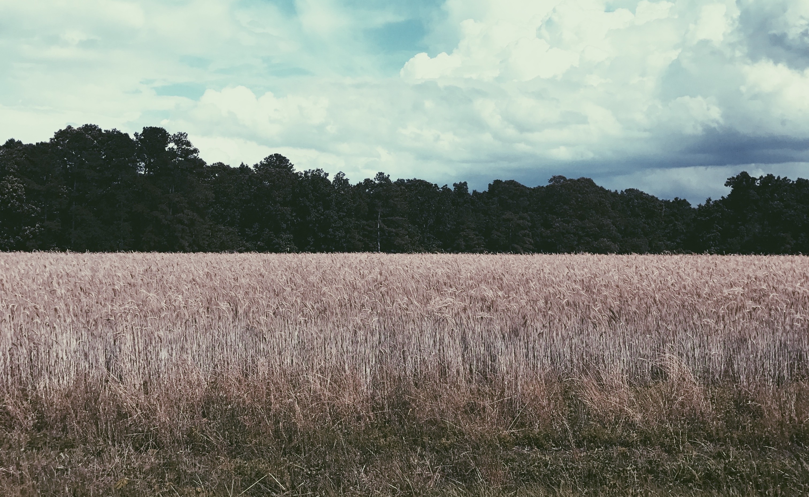
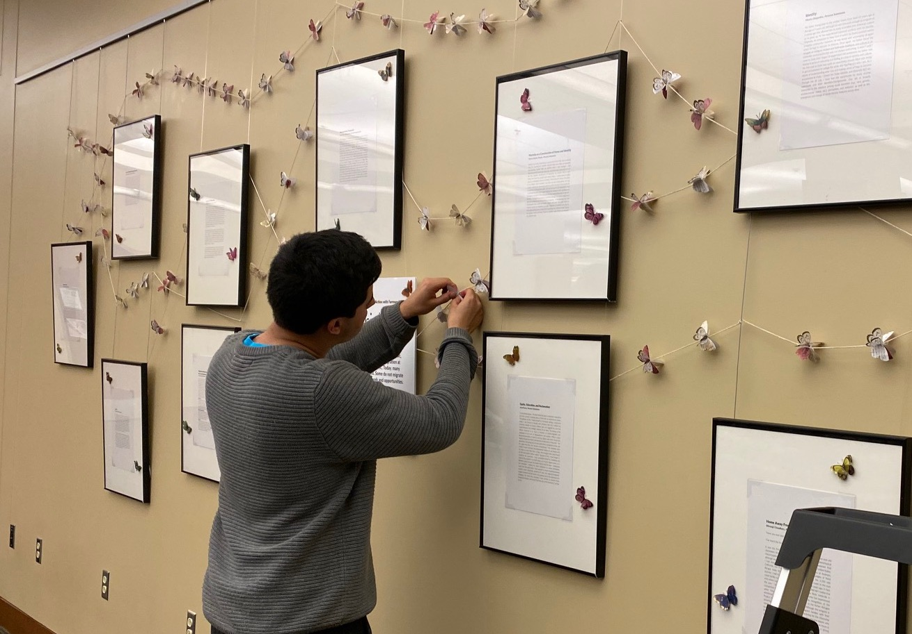

 

# About Me

***

 

## Background

I was born in the capital of Guatemala and lived in an impoverished, urban neighborhood for the first two years of my life. I immigrated to the U.S. soon after, and moved across several cities on the east coast. For most of my life, I was raised in a small town in North Carolina called Sanford, which is about 45 minutes south of Raleigh. I attended public schools and was fortunate enough to gain acceptance to the North Carolina Governor's School summer program in 2016, where I attended for mathematics. Despite growing up well-below the poverty line most of my life, I made the best with what I had, and I thank the countless educators, coaches, and mentors in Sanford for always pushing me to excel.

 
 

 
 

## Education

After graduating from Southern Lee High School, I attended Duke University. Thankfully, I was accepted as a [David M. Rubenstein Scholar](https://rubensteinscholars.duke.edu/), which has provided me a loan-free, fully-funded educational experience, among many other resources. I am a Statistical Science major at Duke, where I have been trained in Bayesian methods and highly encouraged to pursue independent, interdisciplinary research. I apply rigorous, quantitative methods to interesting social phenomena, which is how I was led to pursue a Sociology minor. I am mostly interested in understanding how processes like assimilation can shape experiences for immigrants and the consequences of knowing or not knowing certain information that occur as a result. Some questions I often ponder about include: How does neighborhood destination affect mobility outcomes? Are institutions such as schools or non-profits that provide resources in certain areas accessible? Does the "perfect" immigrant exist, or are there structures that benefit actors in groups more than others, in regard to social, political, and economic mobility? What are the trade-offs for pursuing mobility in one domain than in others, and what are the variables that measure "success"?

 

 

Beyond my academic interests, I am also involved in several extracurricular activities. I am President of the Define American chapter at Duke, an immigration-advocacy organization that seeks to engage the Duke and Durham community in local and national immigration policy updates and events. I am also the President of the German Club, where I help coordinate events throughout the semester and encourage introductory-level German students to partake in them. Throughout my time at Duke, both of these organizations have greatly influenced how much I enjoy conversations regarding immigration, conflict, and comparative movements between Germany and the United States. Other involvements include the [Lee County Ready for College Initiative](https://www.lcrfci.com/home), [Sanford Community Freedom Coalition](https://www.facebook.com/Sanford-Community-Freedom-Coalition-108514584353849/), and playing tennis with friends.
