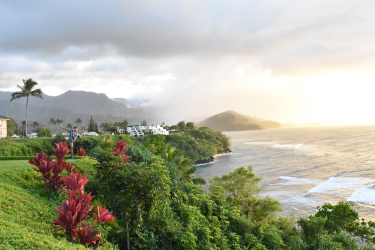

 

# Rosvid Steven Herrera Tenorio (He/Him/His)

***

 

 

I am a 4th-year undergraduate at Duke University, majoring in Statistical Science and minoring in Sociology. I've spent my past three summers researching [alt-right groups through the Data+ Program](https://bigdata.duke.edu/projects/latinxs-and-right), interning as a [software engineer at Twitter](https://twitter.com/terns/status/1155956826342477824), and volunteering at the [Waipa Foundation in Hawaii](https://dukeengage.duke.edu/pineapples-in-the-kauai-garden/). My research interests include quantitative methodology, demography, (im)migration, and neighborhood effects. I was born in Guatemala City, Guatemala, immigrated to a small, rural town in North Carolina called Sanford (where I grew up), and now live in Cary, North Carolina. My long-term goal is to become a Professor of Sociology.

 

The code to make this website is [here](https://github.com/stevenherrera24/stevenherrera24.github.io). To contact me, click [here](https://stevenherreratenorio.com/contact.html). Last update: February 18, 2021

